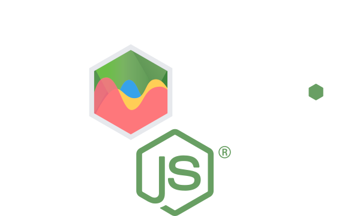

<!-- [](https://github.com/SeanSobey/ChartjsNodeCanvas) -->
<a href="https://github.com/SeanSobey/ChartjsNodeCanvas" align="center">
  
</a>

# chartjs-node-canvas

<!-- [](https://circleci.com/gh/SeanSobey/ChartjsNodeCanvas) -->
[](https://github.com/SeanSobey/ChartjsNodeCanvas/actions)
[](https://codecov.io/gh/SeanSobey/ChartjsNodeCanvas)
[](https://www.npmjs.com/package/chartjs-node-canvas)
[](https://bundlephobia.com/result?p=chartjs-node-canvas)
<!-- [](https://bundlephobia.com/result?p=chartjs-node-canvas) -->
<!-- [](https://bundlephobia.com/result?p=chartjs-node-canvas) -->

A Node JS renderer for [Chart.js](http://www.chartjs.org) using [canvas](https://github.com/Automattic/node-canvas).

Provides and alternative to [chartjs-node](https://www.npmjs.com/package/chartjs-node) that does not require jsdom (or the global variables that this requires) and allows chartJS as a peer dependency, so you can manage its version yourself.

## Contents

1. [Installation](#installation)
2. [Node JS version](#node-js-version)
3. [Features](#features)
4. [Limitations](#limitations)
5. [API](#api)
6. [Usage](#usage)
7. [Known Issues](#known-issues)

## Installation

```
npm i chartjs-node-canvas chart.js
```

### Node JS version

This is limited by the upstream dependency [canvas](https://github.com/Automattic/node-canvas).

See the GitHub Actions [yml](.github/workflows/nodejs.yml) section for the current supported Node version(s). You will need to do a `npm rebuild` to rebuild the canvas binaries.

### Charts.JS version

Currently supports 3.x.x. You are given the ability to maintain the version yourself via peer dependency, but be aware that going above the specified [version](./package.json) might result in errors.

## Features

* Supports all Chart JS features and charts.
* No heavy DOM virtualization libraries, thanks to a [pull request](https://github.com/chartjs/Chart.js/pull/5324) to chart.js allowing it to run natively on node, requiring only a Canvas API.
* Chart JS is a peer dependency, so you can bump and manage it yourself.
* Provides a callback with the global ChartJS variable, so you can use the [Global Configuration](https://www.chartjs.org/docs/latest/configuration/#global-configuration).
* Uses (similar to) [fresh-require](https://www.npmjs.com/package/fresh-require) for each instance of `ChartJSNodeCanvas`, so you can mutate the ChartJS global variable separately within each instance.
* Support for custom fonts.

## Limitations

### Animations

Chart animation (and responsive resize) is disabled by this library. This is necessary since the animation API's required are not available in Node JS/canvas-node (this is not a browser environment after all).

This is the same as:

```js
Chart.defaults.animation = false;
Chart.defaults.responsive = false;
```

### SVG and PDF

For some unknown reason canvas requires use of the [sync](https://github.com/Automattic/node-canvas#canvastobuffer) API's to use SVG's or PDF's. This libraries which support these are:

* [renderToBufferSync](./API.md#ChartJSNodeCanvas+renderToBufferSync) ('application/pdf' | 'image/svg+xml')
* [renderToStream](./API.md#ChartJSNodeCanvas+renderToStream) ('application/pdf')

You also need to set the canvas type when you initialize the `ChartJSNodeCanvas` instance like the following:

```js
const { ChartJSNodeCanvas } = require('chartjs-node-canvas');

const chartJSNodeCanvas = new ChartJSNodeCanvas({ type: 'svg', width: 800, height: 600 }); 
```

## API

See the [API docs](https://github.com/SeanSobey/ChartjsNodeCanvas/blob/master/API.md).

## Usage

```js
const { ChartJSNodeCanvas } = require('chartjs-node-canvas');

const width = 400; //px
const height = 400; //px
const backgroundColour = 'white'; // Uses https://www.w3schools.com/tags/canvas_fillstyle.asp
const chartJSNodeCanvas = new ChartJSNodeCanvas({ width, height, backgroundColour});

(async () => {
    const configuration = {
        ... // See https://www.chartjs.org/docs/latest/configuration
    };
    const image = await chartJSNodeCanvas.renderToBuffer(configuration);
    const dataUrl = await chartJSNodeCanvas.renderToDataURL(configuration);
    const stream = chartJSNodeCanvas.renderToStream(configuration);
})();
```

Also see the [example](./src/example.ts) and the generated [image](./example.png).

### Memory Management

Every instance of `ChartJSNodeCanvas` creates its own [canvas](https://github.com/Automattic/node-canvas). To ensure efficient memory and GC use make sure your implementation creates as few instances as possible and reuses them:

```js
// Re-use one service, or as many as you need for different canvas size requirements
const smallChartJSNodeCanvas = new ChartJSNodeCanvas({ width: 400, height: 400 });
const bigCChartJSNodeCanvas = new ChartJSNodeCanvas({ width: 2000, height: 2000 });

// Expose just the 'render' methods to downstream code so they don't have to worry about life-cycle management.
exports = {
    renderSmallChart: (configuration) => smallChartJSNodeCanvas.renderToBuffer(configuration),
    renderBigChart: (configuration) => bigCChartJSNodeCanvas.renderToBuffer(configuration)
};
```

### Custom Charts

Just use the ChartJS reference in the callback:

```js
const chartJSNodeCanvas = new ChartJSNodeCanvas({ width, height, chartCallback: (ChartJS) => {
    // New chart type example: https://www.chartjs.org/docs/latest/developers/charts.html
    class MyType extends Chart.DatasetController {

    }

    Chart.register(MyType);
    }
});
```

### Global Config

Just use the ChartJS reference in the callback:

```js
const chartJSNodeCanvas = new ChartJSNodeCanvas({ width, height, chartCallback: (ChartJS) => {
    // Global config example: https://www.chartjs.org/docs/latest/configuration/
    ChartJS.defaults.elements.line.borderWidth = 2;
} });
```

### Custom Fonts

Just use the `registerFont` method:

```js
const chartJSNodeCanvas = new ChartJSNodeCanvas({ width, height, chartCallback: (ChartJS) => {
    // Just example usage
    ChartJS.global.defaultFontFamily = 'VTKS UNAMOUR';
} });
// Register before rendering any charts
chartJSNodeCanvas.registerFont('./testData/VTKS UNAMOUR.ttf', { family: 'VTKS UNAMOUR' });
```

See the node-canvas [docs](https://github.com/Automattic/node-canvas#registerfont) and the chart js [docs](https://www.chartjs.org/docs/latest/general/fonts.html).

### Background color

Due to the many issues and question this includes a [convenience plugin](./src/backgroundColourPlugin.ts) to fill the otherwise transparent background. It uses the [fillStyle](https://www.w3schools.com/tags/canvas_fillstyle.asp) canvas API;

```js
const chartJSNodeCanvas = new ChartJSNodeCanvas({ width, height, backgroundColour: 'purple' });
```

### Loading plugins

This library is designed to make loading plugins as simple as possible. For legacy plugins, you should just be able to add the module name to the appropriate array option and the library handles the rest.

The Chart.JS [plugin API](https://www.chartjs.org/docs/latest/developers/plugins.html) has changed over time and this requires compatibility options for the different ways plugins have been historically loaded. ChartJS Node Canvas has a `plugin` option with specifiers for the different ways supported plugin loading methods are handled. If you are not sure about your plugin, just try the different ones until your plugin loads:

#### Newer plugins

Let `ChartJSNodeCanvas` manage the lifecycle of the plugin itself, each instance will have a separate instance of the plugin:

```js
const chartJSNodeCanvas = new ChartJSNodeCanvas({ width, height, plugins: {
    modern: ['chartjs-plugin-annotation']
} });
```

You want to share the plugin instance, this may cause unwanted issues, use at own risk:

```js
const chartJSNodeCanvas = new ChartJSNodeCanvas({ width, height, plugins: {
    modern: [require('chartjs-plugin-annotation')]
} });
```

#### Older plugins

---

1. Plugin that expects a global Chart variable.

```js
const chartJSNodeCanvas = new ChartJSNodeCanvas({ width, height, plugins: {
    requireChartJSLegacy: ['<some plugin>']
}});
```

2. Plugins that `require` ChartJS themselves.

```js
const chartJSNodeCanvas = new ChartJSNodeCanvas({ width, height, plugins: {
    globalVariableLegacy: ['chartjs-plugin-crosshair']
} });
```

3. Register plugin directly with ChartJS:

```js
const chartJSNodeCanvas = new ChartJSNodeCanvas({ width, height, plugins: {
    requireLegacy: ['chartjs-plugin-datalabels']
} });
```

---

These approaches can be combined also:

```js
const chartJSNodeCanvas = new ChartJSNodeCanvas({ width, height, plugins: {
    modern: ['chartjs-plugin-annotation'],
    requireLegacy: ['chartjs-plugin-datalabels']
} });
```

See the [tests](src/index.e2e.spec.ts#106) for some examples.

## Known Issues

There is a problem with persisting config objects between render calls, see this [issue](https://github.com/SeanSobey/ChartjsNodeCanvas/issues/9) for details and workarounds.
